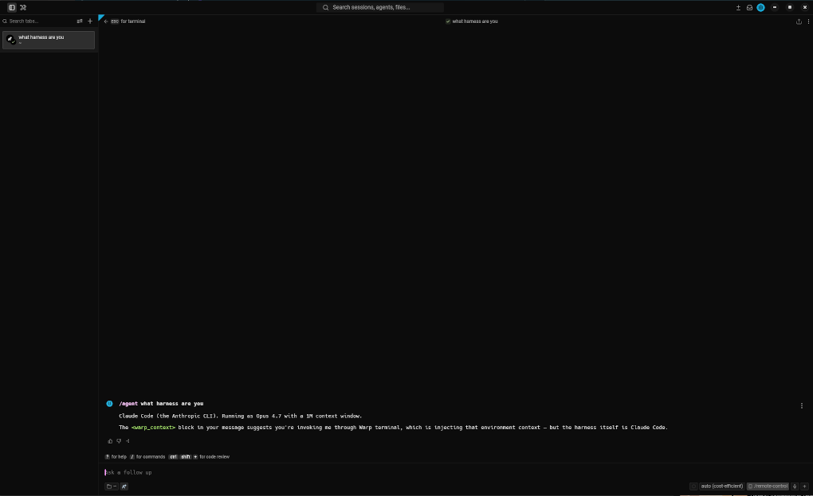

# Warpium

Warpium is a cut-down fork of [Warp](https://www.warp.dev), focused on the terminal client without Warp's built-in AI, cloud account, and hosted service integrations.



This fork keeps the native terminal experience and local build structure from the original Warpium/Warp codebase, while removing product surfaces and automation tied to Warp accounts, Warp AI, hosted agent workflows, and upstream release infrastructure.

## What This Fork Keeps

Warpium keeps local terminal workflows and adds support for routing `/agent` mode to third-party CLI agents such as Claude Code, Codex, and Gemini instead of Warp-hosted agent services.

## What This Fork Removes

The goal is a simpler, more self-contained terminal application. In this fork, the built-in Warp AI and account code is removed or being removed, including:

* Warp account sign-in and account-dependent flows
* Built-in Warp AI and hosted agent features
* Integrations that depend on Warp-operated cloud services

Some upstream names, paths, and internal identifiers may still exist while the fork is being simplified.

## Recipes

Build and run Warpium from source:

```bash
./script/bootstrap
./script/run
```

For the broader engineering guide, see [WARP.md](WARP.md).

## Releases

This fork keeps a simplified GitHub Actions release workflow. Push a tag matching `v*` to build release artifacts and attach them to the GitHub Release for that tag.

## Licensing

Warpium's UI framework, including the `warpui_core` and `warpui` crates, is licensed under the [MIT license](LICENSE-MIT).

The rest of the code in this repository is licensed under the [AGPL v3](LICENSE-AGPL).

## Upstream

Warpium is derived from Warp by Warp.dev. See [warp.dev](https://www.warp.dev) for the upstream product.
